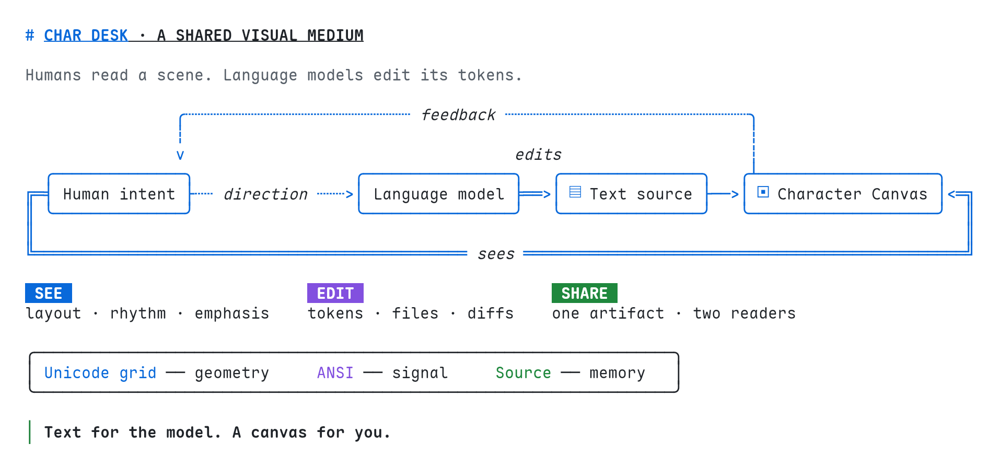
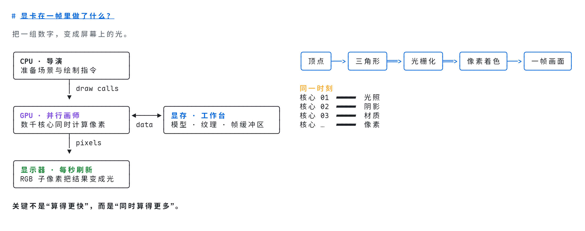
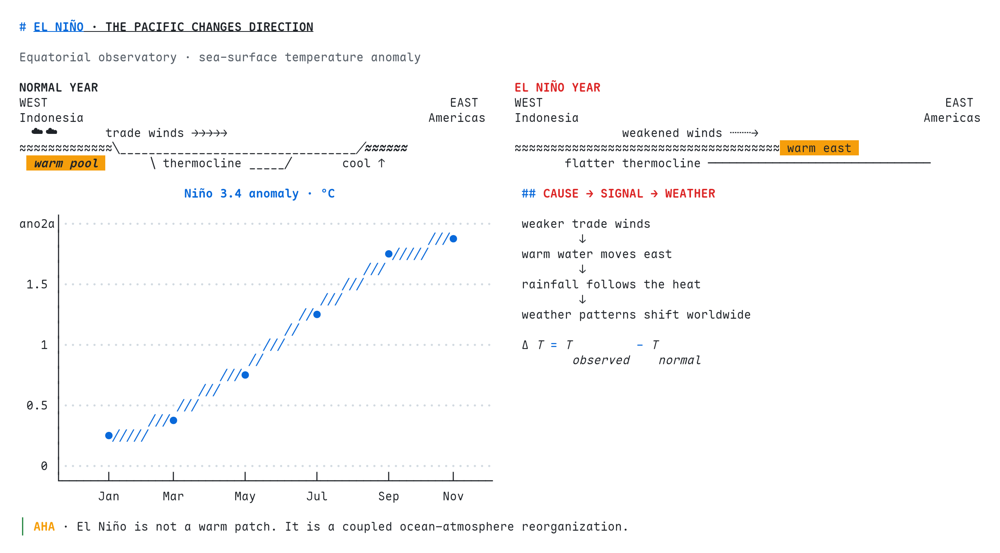
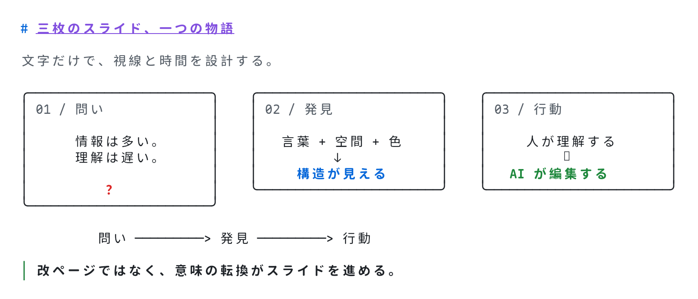
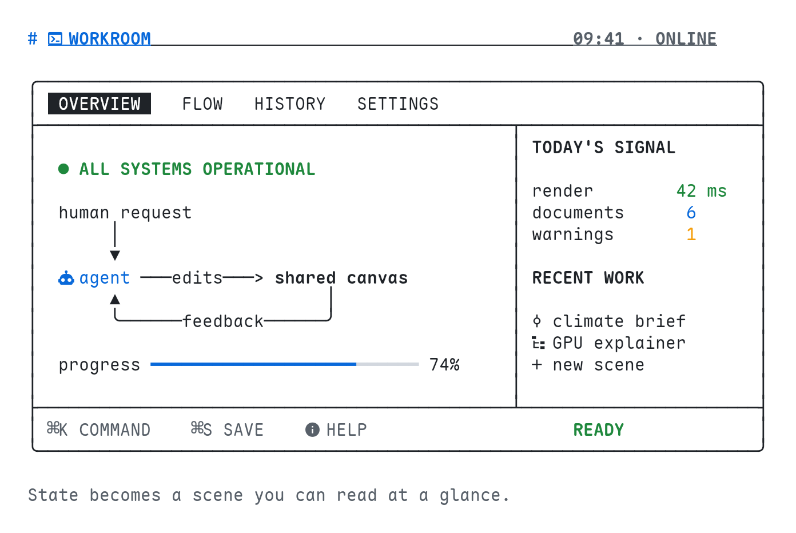
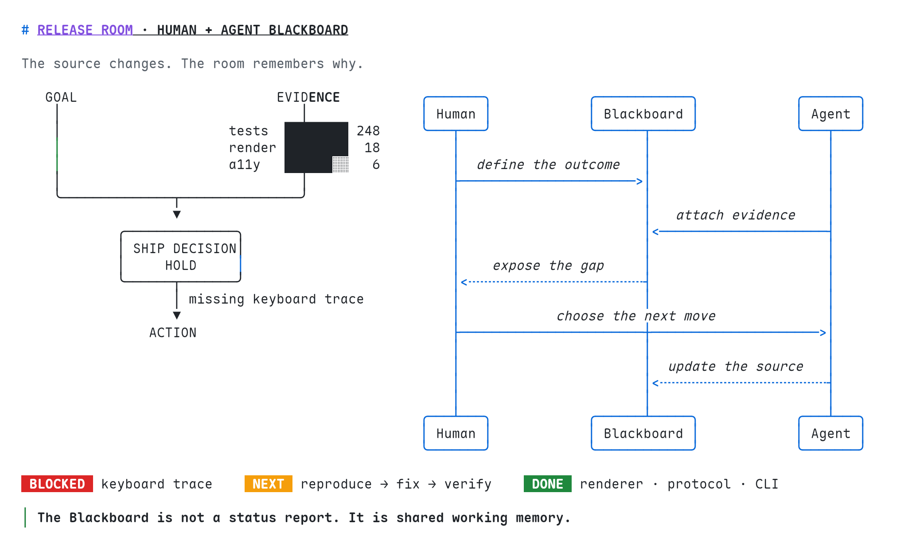
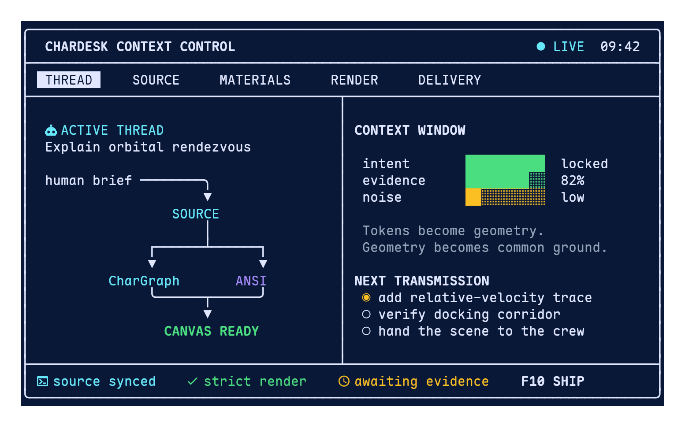
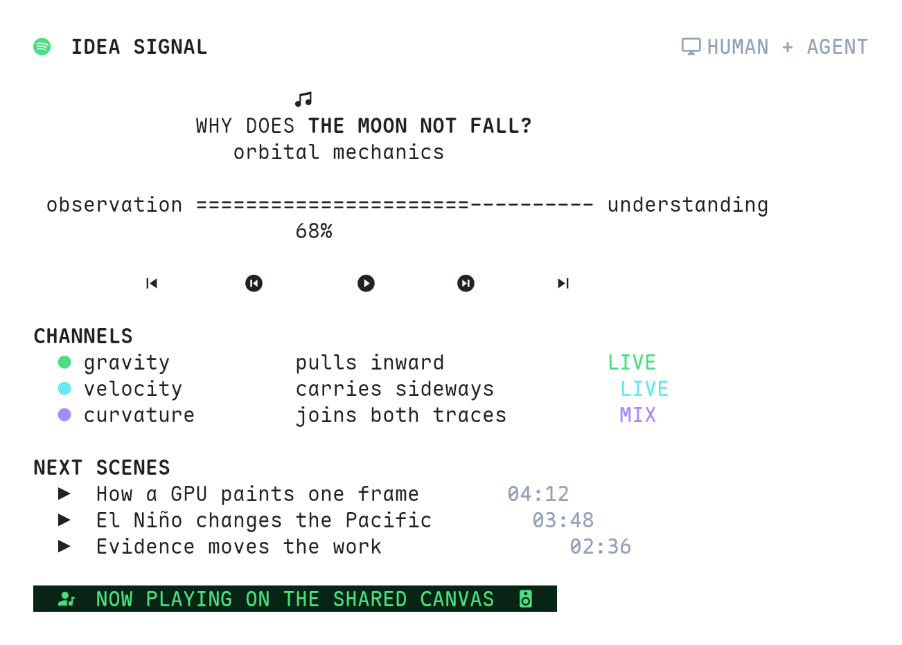
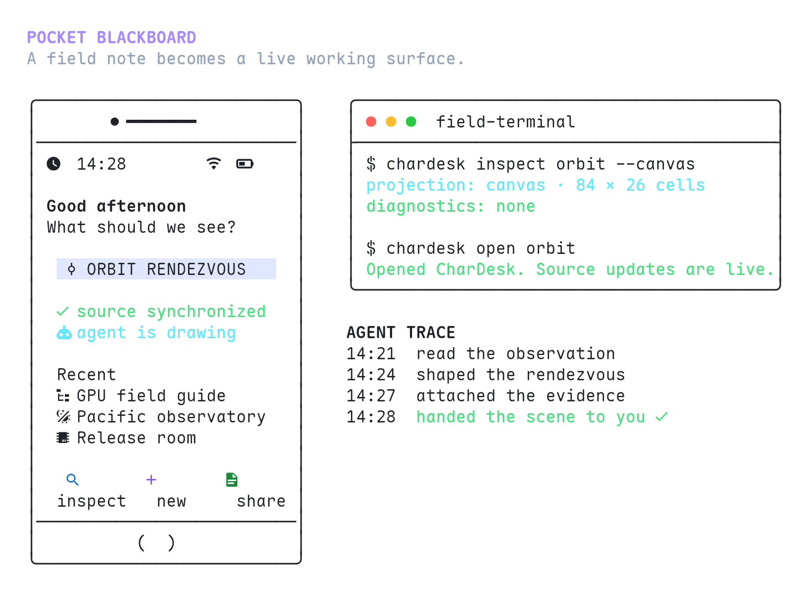

[English] | [简体中文](./README.zh-CN.md)

# CharDesk

> **A shared visual medium for people and agents.**

CharDesk gives people and LLM-powered agents a common artifact: visual Unicode text. Its infinite Canvas lets people draw diagrams and interfaces while agents inspect the source, revise it, and verify the result. Cell UI applies the same medium to interactive interfaces.

[Open Canvas](https://canvas.chardesk.com/) · [Explore Cell UI](https://ui.chardesk.com/)

[Product home](https://chardesk.com/) · [CharGraph](https://chardesk.com/chargraph/) · [CLI reference](packages/cli/README.md)

## Start with your agent

Requires Node.js 20 or later.

```sh
npx skills add https://github.com/sayhi-bzb/chardesk --skill chardesk
```

Register the MCP server with your agent:

```sh
# Codex
codex mcp add chardesk -- npx -y @chardesk/mcp

# Claude Code
claude mcp add chardesk -- npx -y @chardesk/mcp

# Pi
pi mcp add chardesk -- npx -y @chardesk/mcp
```

After that, no manual `server` or `pair` command is needed. The first Canvas tool call opens Canvas when necessary, and the page connects to the local bridge automatically.

The CLI is optional for local file workflows:

```sh
npm install -g @chardesk/cli
```

Then tell your agent what you want to see:

```text
$chardesk Explain how a GPU works as a visual Canvas.
```

The agent creates the source, checks it, and opens the canvas. You do not need to learn a file format or configure an AI provider first.

## What you can make

- Explain a concept as a spatial story instead of a wall of text.
- Present an idea as character-based slides.
- Build scientific figures with plots, formulas, data, and annotations.
- Sketch interfaces, terminals, dashboards, and product states.
- Map architectures, workflows, timelines, and relationships.
- Keep a Canvas that people and agents can inspect and revise together.

[](apps/site/showcase-sources/01-shared-medium.md)

**Shared medium** · [Source](apps/site/showcase-sources/01-shared-medium.md)

[](apps/site/showcase-sources/02-gpu-blackboard.zh-CN.md)

**Visual explanation** · [Source](apps/site/showcase-sources/02-gpu-blackboard.zh-CN.md)

[](apps/site/showcase-sources/03-el-nino-observatory.md)

**Scientific figure** · [Source](apps/site/showcase-sources/03-el-nino-observatory.md)

[](apps/site/showcase-sources/04-story-slides.ja.md)

**Character slides** · [Source](apps/site/showcase-sources/04-story-slides.ja.md)

[](apps/site/showcase-sources/05-interface-console.md)

**Interface design** · [Source](apps/site/showcase-sources/05-interface-console.md)

[](apps/site/showcase-sources/06-agent-blackboard.md)

**Agent Canvas** · [Source](apps/site/showcase-sources/06-agent-blackboard.md)

### ANSI interface studies

[](apps/site/showcase-sources/07-context-control-room.md)

**Context Control Room** · [Source](apps/site/showcase-sources/07-context-control-room.md)

[](apps/site/showcase-sources/08-idea-signal-player.md)

**Idea Signal Player** · [Source](apps/site/showcase-sources/08-idea-signal-player.md)

[](apps/site/showcase-sources/09-pocket-blackboard.md)

**Pocket Canvas** · [Source](apps/site/showcase-sources/09-pocket-blackboard.md)

## Why text can be visual

People scan a two-dimensional surface. Language models generate and edit token sequences. Screenshots preserve layout, but add pixel noise and are awkward to revise precisely across turns; plain text is easy to edit, but normally gives up space and style.

CharDesk keeps both. A fixed Unicode grid carries position, box drawing carries structure, and ANSI carries emphasis. The result remains selectable, searchable, diffable, and directly editable by an agent.

```text
   Person reads and uses
           ⇅
   Shared Unicode scene
           ⇅
   Agent reads and edits
```

## The medium

### Visual text

Unicode, box drawing, CJK, technical symbols, monochrome emoji, and Nerd Font glyphs share one grid. ESC-less ANSI adds foreground and background colors, bold, italic, underline, strike, and inverse styles without turning the work into an image.

### Structured expression

Write Markdown, Mermaid, math, GFM tables, fenced code, JSON, YAML, Vega-Lite, and XY or line charts. CharGraph compiles structured source into portable character graphics while preserving the source that produced it.

### Spatial composition

Arrange content on Freeform canvases, start from reusable Cell templates, compose multiline fields with `|||` and `---`, or tell a story with Slides. Every form resolves to the same character-grid rendering pipeline.

### Agent access

- **Local MCP:** register `@chardesk/mcp` once with your agent (Codex, Claude Code, or Pi). The agent starts it automatically; Canvas discovers the local bridge and the first `canvas_*` call opens Canvas if needed. See the [MCP package reference](packages/mcp/README.md).
- **Local files and CLI:** the stable default. Agents use normal file tools; `chardesk` checks, previews, opens, and renders the result. See the [CLI reference](packages/cli/README.md).
- **Chrome WebMCP:** experimental. Enable `chrome://flags/#enable-webmcp-testing`, relaunch Chrome, and use the browser path only when needed.
- **ChatGPT Site Tools:** experimental. Enable **Site tools** under **Settings → Browser → Permissions**, then open CharDesk in ChatGPT's built-in browser. See the [official Site Tools guide](https://learn.chatgpt.com/docs/webmcp).

Browser agents can call `chardesk_read_materials` to enter the same visual language and worked examples as the skill. Canvas tools read, search, and write the active two-dimensional Cell surface.

## For builders

Use [`@chardesk/protocol`](packages/protocol/README.md) for interchange, [`@chardesk/viewer`](packages/viewer/README.md) for framework-independent rendering, and [`@chardesk/fonts`](packages/fonts/README.md) for the compatible glyph set. Each package owns its installation and API documentation.

## Thanks

Thanks to [LINUX DO](https://linux.do/).

## License

CharDesk is open source under the [MIT License](LICENSE).
